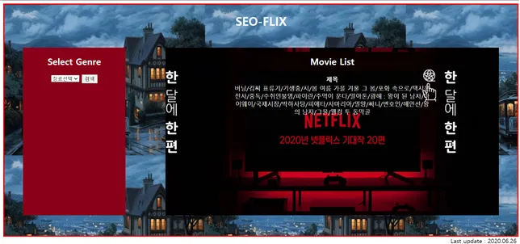

### 영화추천 사이트

**설계 혹은 작품 제작과정에서의 시행착오 과정을 기술**

이번 설계를 진행하면서 가장 처음 겪은 시행착오라고 한다면, 데이터베이스의 선택입니다. 데이터베이스 랭킹 사이트에 있는 수많은 데이터베이스 중에서 제가 사용하기에 적절한 KEY-VALUE STORE를 제공하는 데이터베이스를 선택하기가 매우 까다로웠습니다.
그래서 그 중 REDIS가 가장 적절하다고 생각하여, 선택하였습니다. 그러나, REDIS를 DJANGO와 연동하여 사용하려고 하는 과정에서 다음 문제가 발생하였습니다. 대부분의 NO SQL 기반 데이터베이스는 IN MEMORY를 메인으로 한다는 것을 진행하고 나서야 알게 되었습니다. 
즉, 대부분의 사용 예를 보니 cache로서 사용하는 경우가 많았습니다. 이번 프로젝트 과제에서 원하는 것은 cache가 아닌, 저장해 둔 값을 찾는 것이기에 적절하지 않다고 생각됐습니다. 그래서 다른 적절한 데이터베이스를 찾는 과정이 아주 험난했습니다. 
DJANGO와 연동되는 것 중 KEY-VALUE STORE를 제공하는 데이터베이스를 찾아야했습니다. 그래서 DJANGO에서 제공하는 것 중 있는지 찾아봤습니다. django-kvstore, django-hstore, django-postgresql 등 다양하게 찾아보았으나, 전부 사용하기에 부적합했습니다.
그래서 결국, 효율적이지는 못하지만, key-value 기반인 pickleDB를 사용하여, django에서 key 값을 넘겨주면, pickleDB의 value 값을 받아, 그 value 값을 MariaDB의 데이터의 key로 사용하여 저장된 값을 불러오는 방식으로 하였습니다.
key-value를 사용하기는 했으나, 비효율적인 방법이라 아쉽습니다. 데이터베이스를 선택하는 과정에서, key-value에 관한 개념에 대해 생각이 많았습니다. 데이터베이스에 있는 테이블의 값을 조건에 해당하는 값을 가진 테이블의 자료들을 가져오는 것 또한 key-value가 아닌가와 같은 생각이 들었습니다.
그래도 직관적으로 KEY-VALUE를 사용하는 데이터베이스를 선택했습니다. 그렇게 데이터베이스에 관한 문제는 해결되었고, 이제는 데이터를 삽입하기 위해서 데이터 조사를 하는 것이 어려웠습니다. 제가 검색하여 영화를 찾는 것에는 한계가 있어 데이터베이스에 자료가 부족하다는 생각이 듭니다.
